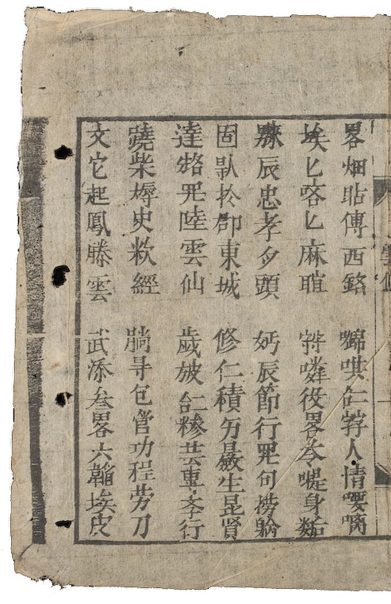
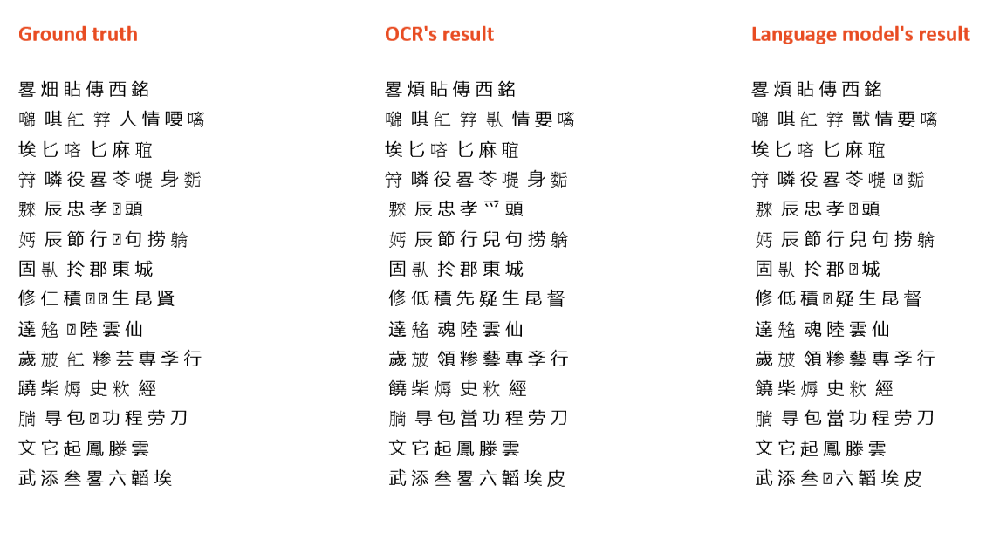

# Towards-Nom-historical-document-optical-character-recognition-Implement
An unofficial implementation of [TOWARDS NÔM HISTORICAL DOCUMENT OPTICAL CHARACTER RECOGNITION](http://vap.ac.vn/Portals/0/TuyenTap/2021/12/22/1ecec417207345d595e011cb434f7fe8/25_FAIR2021_paper_191.pdf) (Tran Thi Anh Thu, Le Pham Ngoc Yen, Tran Thai Son, Dinh Dien).

As the paper doesn't give implementation detail of language model used in the post processing phase, we apply a very simple algorithm to integrate language model to OCR. Also the data resources we have are limited compared to the paper.

_This is a project for an Introduction to Natural Language Processing class. View our [slides](Group04_Slides.pdf) in Vietnamese._ 

## Model Architecture

OCR:
* Detection model: `YOLOv5`
* Classification model: `Resner101`

Get top k (k=3 or 5) candidates for each token in classification result.

![ARCHITECTURE_1][architecture_1]

[architecture_1]: images/architecture_1.png

We apply a language model for error detection and correction:
* Model: training pretrained-model `MacBERT` with Nom embeddings.
* Masking strategy: we mask random character with character that look similar (both characters appear in luc-van-tien)

![ARCHITECTURE_2][architecture_2]

[architecture_2]: images/architecture_2.png

## Data
We use character dataset, TKH-MTH (MTH1000 + MTH1200 + TKH) for training and valid the performace of OCR process.

`YOLOv5`
* Train: _MTH1200 + TKH_
* Valid: _MTH1000_

`ResNet101`
* Train + valid: _character dataset + TKH-MTH (only characters that appearing in Luc-Van-Tien)_

About `language model`, we use following txt file: 
* Train: _tale-of-kieu-1870, ngoc-kieu-le-tan-truyen, ho-xuan-huong, gia-huan-ca, chinh-phu-ngam-khuc-nlvnpf-0059, buon-hoa-tan-truyen-2, bai-ca-ran-co-bac_
* Valid:  _tale-of-kieu-1902, luc-van-tien-nlvnpf-0059_

Luc-Van-Tien dataset is used for testing. **The number of labels in Luc Van Tien is 2010; we have 1902 of them, accounting for approximately 93% of the characters in Luc Van Tien.**

The datasets are organized in the following structure:
```
Luc-Van-Tien
|- images
|  |- nlvnpf-0059-002.jpg
|  |- nlvnpf-0059-003.jpg
|  |- nlvnpf-0059-004.jpg
|  |- ...
|- anotation.csv
```

```
character dataset
|- 2A0F4
|  |- 2A0F4_1.jpg
|  |- 2A0F4_2.jpg
|- 2A1F4
|- 2A004
|- ...
```

_Except for the Han dataset (TKH-MTH), all datasets are private._

## Performance

Although we don't have enough data like the paper, a very close [mAP@0.5](https://github.com/rafaelpadilla/Object-Detection-Metrics) of OCR is achieved in this repo. However, the result of language model is is poor; we hope to see a better method in the near future.

| mAP@0.5           | OCR | Language model        | 
| ----------------- | -------------- | --------------- |
| Our model         | 0.69 - 0.71    | ±≈0.05          | 
| Paper             | ≈0.73          | 0.82            | 

## Result

<div align="center">
  <a href="https://github.com/nguyendothanhtruc/Towards-Nom-historical-document-optical-character-recognition-Implement">
    
  </a>
  <br />
  <p><sub>One page of Luc Van Tien, read from Top-to-Bottom, Right-to-Left (Tung Thư)</sub></p>
  <br />
</div>  

Result of our model:

<div align="center">
  <a href="https://github.com/nguyendothanhtruc/Towards-Nom-historical-document-optical-character-recognition-Implement">
    
  </a>
</div>  
